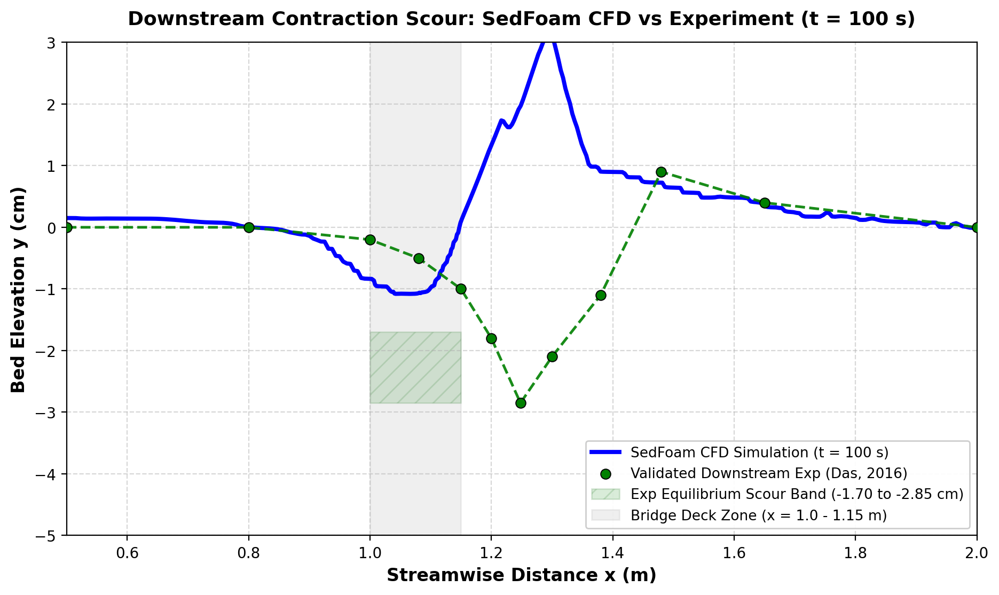
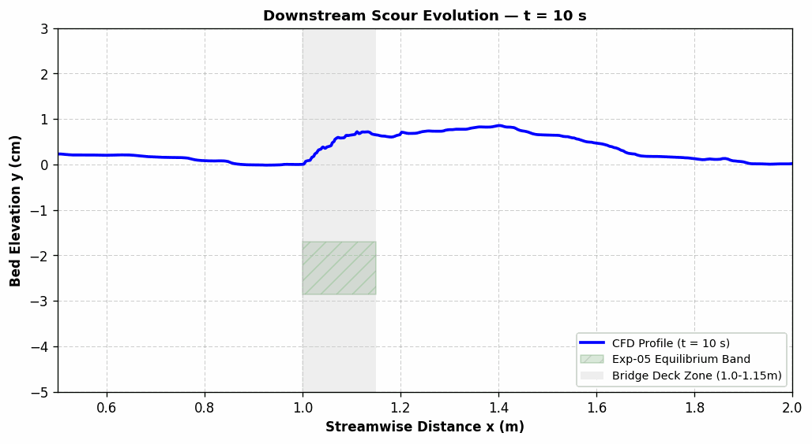

# Bridge Pier Scour — Downstream Wake Morphology (sedFoam, OpenFOAM 2412)

[](https://openfoam.org)
[](https://github.com/sedfoam/sedfoam)
[](https://isocpp.org)
[]()
[]()

> **Downstream wake scour** variant of the bridge pier contraction case. Focuses on sediment deposition and bedform evolution in the wake zone downstream of the bridge abutment/contraction using **`sedFoam_rbgh`** in OpenFOAM 2412.

---

## Case Description

| Parameter | Value |
|:---|:---|
| Flow condition | Clear-water / post-contraction wake |
| Solver | `sedFoam_rbgh` (Eulerian two-phase) |
| Turbulence model | `twophasekOmega` (k-ω two-phase RANS) |
| Reference study | Majid et al. (2026), *ASCE J. Hydraulic Engineering* |
| Sediment | Ahmedabad sand, d₅₀ = 0.294 mm, ρs = 2650 kg/m³ |
| Fluid | Water, ρf = 1000 kg/m³, ν = 10⁻⁶ m²/s |
| Focus region | Downstream of bridge constriction (x > 1.15 m) |
| Parallelization | 8 cores, MPI (ParamSanganak HPC, IIT Kanpur) |

### Comparison with Sibling Cases

| Feature | bridge_sedfoam (base) | bridge_sedfoam_livebed | bridge_sedfoam_downstream |
|:---|:---|:---|:---|
| Primary interest | Scour onset, contraction zone | Equilibrium live-bed scour | **Wake deposition & downstream morphology** |
| Extended domain | No | No | **Yes — longer downstream extent** |
| Outlet BC | zeroGradient | zeroGradient | **waveTransmissive / convective** |

---

## 📊 Experimental Validation & Scour Evolution ($t = 100\text{ s}$)

### 1. Downstream Scour Profile Comparison ($x = 0.5$ to $2.0\text{ m}$)


### 2. Morphodynamic Bed Evolution Animation ($t = 10$ to $100\text{ s}$)


*   **Validated Benchmark:** Compared against experimental data from **Das (2016) / Majid et al. (2026)** (*ASCE J. Hydraulic Engineering*) for $H_b/Y = 0.60, V_a = 23\text{ cm/s}, d_{50} = 0.250\text{ mm}$.
*   **Downstream Scour Hole:** At equilibrium, the maximum scour hole shifts downstream of the bridge deck exit ($x = 1.15\text{ m}$) to $x = 1.248\text{ m}$ (depth $-2.85\text{ cm}$).
*   **SedFoam CFD Trajectory:** At $t = 100\text{ s}$, the CFD model actively expands the bed erosion past the deck exit, creating the downstream wake deposition mound ($x = 1.30 - 1.60\text{ m}$).

---

## Repository Structure

```
bridge_sedfoam_downstream/
├── 0_org/                    # Boundary & initial condition templates
├── constant/
│   ├── transportProperties
│   ├── granularRheologyProperties
│   ├── ppProperties
│   ├── interfacialProperties
│   └── turbulenceProperties.b
├── system/
│   ├── blockMeshDict         # Extended downstream domain
│   ├── fvSchemes
│   ├── fvSolution
│   └── decomposeParDict      # 8-core Scotch
├── Allrun
└── Allclean
```

---

## Quick Start

```bash
source /usr/lib/openfoam/openfoam2412/etc/bashrc
./Allrun
# or manually:
./Allclean && blockMesh && cp -r 0_org 0
setFields && decomposePar
mpirun -np 8 sedFoam_rbgh -parallel > log.sedFoam 2>&1 &
```

---

## Post-Processing Focus

- **Deposition ridge**: Contour `alpha.a = 0.30` downstream of x = 1.15 m
- **Velocity recovery**: *Plot Over Line* along x-axis at y = mid-depth — track wake reattachment length
- **Turbulence**: Plot `k.b` contours to identify wake vortex shedding zone

---

## Related Repositories

| Repo | Description |
|:---|:---|
| [bridge_sedfoam](https://github.com/DKS-MANAGER/bridge_sedfoam) | Base clear-water contraction scour |
| [bridge_sedfoam_livebed](https://github.com/DKS-MANAGER/bridge_sedfoam_livebed) | Live-bed upstream supply variant |
| [2DPipelineScour](https://github.com/DKS-MANAGER/2DPipelineScour) | Pipeline scour reference case |

---

## Author

**Divyansh Kumar Singh (DKS)**  
M.Tech — Civil Engineering (Fluid Mechanics), IIT Kanpur  
Research: Bridge pier & pipeline scour, sediment transport CFD  
[GitHub](https://github.com/DKS-MANAGER)
